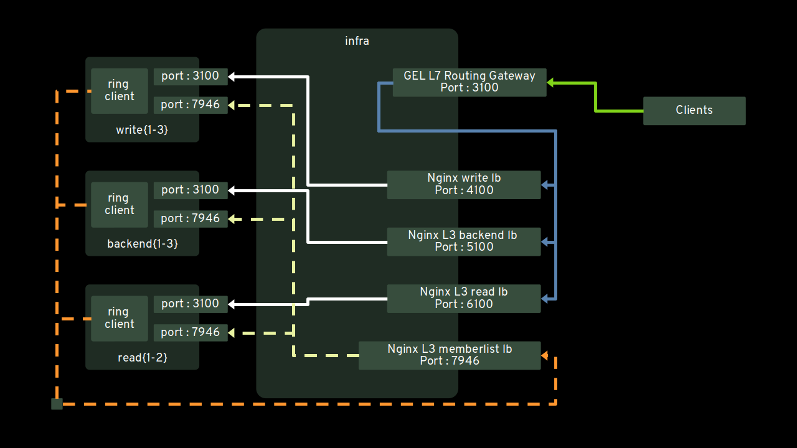

# Install Grafana Enterprise Logs (Loki) on VMS 

## Create 9 vms

2 read vms for querier and query frontend
3 backend vms for the ruler
3 write vms for distributor and ingester
1 for infra

```
debianimage=debian-11-genericcloud-amd64-20230124-1270

vmcreate infra 1048 2 $debianimage 50 40G 1G debian11

vmcreate read01 1048 2 $debianimage 51 40G 1G debian11
vmcreate read02 1048 2 $debianimage 52 40G 1G debian11

vmcreate write01 1048 2 $debianimage 53 40G 1G debian11
vmcreate write02 1048 2 $debianimage 54 40G 1G debian11
vmcreate write03 1048 2 $debianimage 55 40G 1G debian11

vmcreate backend01 1048 2 $debianimage 56 40G 1G debian11
vmcreate backend02 1048 2 $debianimage 57 40G 1G debian11
vmcreate backend03 1048 2 $debianimage 58 40G 1G debian11

dvm infra

dvm read01
dvm read02

dvm write01
dvm write02
dvm write03

dvm backend01
dvm backend02
dvm backend03
```

## Architecture



## Examples of start commands

Monolithic

```
sudo su - enterprise-logs

cd /var/lib/enterprise-logs

/usr/local/bin/enterprise-logs \
              -config.file=/etc/enterprise-logs/config-mono.yaml \
              -target=all
```

Starting gateway for L7 routing towards different microservices.

targeting a single nginx or haproxy host

```
/usr/local/bin/enterprise-logs \
              -config.file=/etc/enterprise-logs/config.yaml \
              -target=gateway \
              -gateway.proxy.default.url=http://infra:5100 \
              -gateway.proxy.admin-api.url=http://infra:4100 \
              -gateway.proxy.compactor.url=http://infra:5100 \
              -gateway.proxy.distributor.url=http://infra:4100 \
              -gateway.proxy.ingester.url=http://infra:4100 \
              -gateway.proxy.query-frontend.url=http://infra:6100 \
              -gateway.proxy.query-scheduler.url=http://infra:5100 \
              -gateway.proxy.ruler.url=http://infra:5100

```


with separate legacy read and write path 

```
/usr/local/bin/enterprise-logs \
              -config.file=/etc/enterprise-logs/config.yaml \
              -target=gateway \
              -gateway.proxy.default.url=http://readpath.loadbalancer:3100 \
              -gateway.proxy.admin-api.url=http://writepath.loadbalancer:3100 \
              -gateway.proxy.compactor.url=http://readpath.loadbalancer:3100 \
              -gateway.proxy.distributor.url=http://writepath.loadbalancer:3100 \
              -gateway.proxy.ingester.url=http://writepath.loadbalancer:3100 \
              -gateway.proxy.query-frontend.url=http://readpath.loadbalancer:3100 \
              -gateway.proxy.query-scheduler.url=http://readpath.loadbalancer:3100 \
              -gateway.proxy.ruler.url=http://readpath.loadbalancer:3100

```

with separate read, write, backend path

```
/usr/local/bin/enterprise-logs \
              -config.file=/etc/enterprise-logs/config.yaml \
              -target=gateway \
              -gateway.proxy.default.url=http://backend.loadbalancer:3100 \
              -gateway.proxy.admin-api.url=http://writepath.loadbalancer:3100 \
              -gateway.proxy.compactor.url=http://backend.loadbalancer:3100 \
              -gateway.proxy.distributor.url=http://writepath.loadbalancer:3100 \
              -gateway.proxy.ingester.url=http://writepath.loadbalancer:3100 \
              -gateway.proxy.query-frontend.url=http://readpath.loadbalancer:3100 \
              -gateway.proxy.query-scheduler.url=http://backend.loadbalancer:3100 \
              -gateway.proxy.ruler.url=http://backend.loadbalancer:3100
```


# Manual checks and creating tenants and access policies through admin api calls

```
ssh cloud-user@infra "sudo /usr/local/bin/enterprise-logs --config.file=/etc/enterprise-logs/config.yaml --target=tokengen --tokengen.token-file=/root/gel-admin-token.txt"

token=`ssh cloud-user@infra "sudo cat /root/gel-admin-token.txt"`

curl http://infra:3100/ready

curl http://write01:3100/ready
curl http://write02:3100/ready
curl http://write03:3100/ready

curl http://backend01:3100/ready
curl http://backend02:3100/ready
curl http://backend03:3100/ready

curl http://read01:3100/ready
curl http://read02:3100/ready

# ################
# gateway
# ################

# services running
curl -u :$token http://infra:3100/services

# ################
# write path
# ################

# services running
curl -u :$token http://write01:3100/services

# ingester ring
curl -u :$token http://write01:3100/ring

# distributor ring
curl -u :$token http://write01:3100/distributor/ring

# ################
# backend path
# ################

# services running
curl -u :$token http://backend01:3100/services

# compactor ring
curl -u :$token http://backend01:3100/compactor/ring

# ruler ring
curl -u :$token http://backend01:3100/ruler/ring

# query scheduler ring
curl -u :$token http://backend01:3100/scheduler/ring

# ################
# read path
# ################

# services running
curl -u :$token http://read01:3100/services


# ################
# create tenant and api token
# ################

# get cluster name and info
curl -s -u :$token http://infra:3100/admin/api/v3/clusters | jq

curl -s -u :$token http://infra:3100/admin/api/v3/tenants --data-raw '
    {
        "name":"dev",
        "display_name": "Grafana Enterprise Logs dev tenant",
        "cluster": "enterprise-logs"
    }
' | jq


curl -s -u :$token http://infra:3100/admin/api/v3/accesspolicies --data-raw '
    {
        "name":"dev-admin",
        "display_name":"tenant admin policy",
        "realms":[
            {
                "tenant":"dev",
                "cluster":"enterprise-logs"
            }
        ],
        "scopes":[
            "admin",
            "alerts:read",
            "alerts:write",
            "logs:delete",
            "logs:write",
            "logs:read",
            "rules:read",
            "rules:write"
        ]
    }
' | jq

curl -s -u :$token http://infra:3100/admin/api/v3/accesspolicies | jq '.items[] | select (.name == "dev-admin")'

curl -s -u :$token -X PUT  -H 'If-Match: "5"' http://write03:3100/admin/api/v3/accesspolicies/dev-admin --data-raw '
    {
        "status": "inactive",
        "display_name":"tenant admin policy",
        "realms":[
            {
                "tenant":"dev",
                "cluster":"enterprise-logs"
            }
        ],
        "scopes":[
            "admin",
            "alerts:read",
            "alerts:write",
            "logs:delete",
            "logs:write",
            "logs:read",
            "rules:read",
            "rules:write"
        ]
    }
' | jq


curl -s -u :$token http://infra:3100/admin/api/v3/accesspolicies --data-raw '
    {
        "name":"dev-app-a",
        "display_name":"read access policy for app a",
        "realms":[
            {
                "tenant":"dev",
                "cluster":"enterprise-logs",
                "label_policies":[
                    {
                        "selector":"{tenant=\"appa\"}"
                    }
                ]
            }
        ],
        "scopes":[
            "alerts:read",
            "alerts:write",
            "logs:read",
            "rules:read",
            "rules:write"
        ]
    }
' | jq


curl -s -u :$token http://infra:3100/admin/api/v3/tokens --data-raw '
{
    "name":"dev-admin-token01", 
    "display_name":"dev-admin-token01",
    "access_policy": "dev-admin"}
' | jq

ZGV2LWFkbWluLXRva2VuMDE6PEAwM2AhMTMxXDBvIzg3OnZlMzhOJiIh

curl -s -u :$token http://infra:3100/admin/api/v3/tokens --data-raw '
{
    "name":"app-a-token01", 
    "display_name":"app-a-token01",
    "access_policy": "dev-app-a"}
' | jq

YXBwLWEtdG9rZW4wMTpRMC58fEoyJjQwOTNffjlMe1w2MF9WNiM=

dev_admin_token=YXBwLWEtdG9rZW4wMTpRMC58fEoyJjQwOTNffjlMe1w2MF9WNiM

current_date=`date +%s%N` && curl -u dev:$dev_admin_token \
-H "Content-Type: application/json" \
-H "X-Scope-OrdID: dev" \
http://infra:3100/loki/api/v1/push \
--data "{\"streams\": [{ \"stream\": { \"job\": \"example\" }, \"values\": [ [ \"$current_date\", \"A log line on dev\" ] ] }]}"


current_date=`date +%s%N` && curl -u dev:$dev_admin_token \
-H "Content-Type: application/json" \
-H "X-Scope-OrdID: dev" \
http://infra:3100/loki/api/v1/push \
--data "{\"streams\": [{ \"stream\": {\"job\": \"test\", \"tenant\": \"appa\" }, \"values\": [ [ \"$current_date\", \"A log line on dev for appa\" ] ] }]}"

current_date=`date +%s%N` && curl -u dev:$dev_admin_token \
-H "Content-Type: application/json" \
-H "X-Scope-OrdID: dev" \
http://infra:3100/loki/api/v1/push \
--data "{\"streams\": [{ \"stream\": { \"job\": \"test\",\"tenant\": \"appb\" }, \"values\": [ [ \"$current_date\", \"A log line on dev for appb\" ] ] }]}"

```